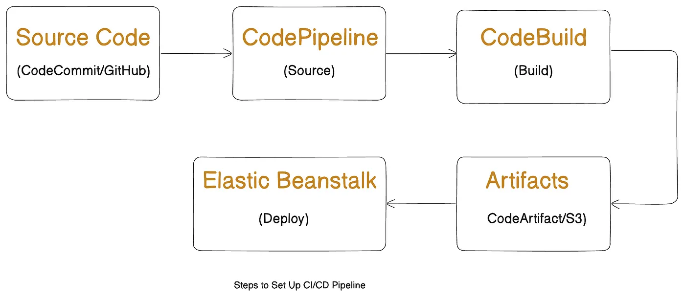

A Practical Approach to Continuous Integration and Continuous Deployment

Now I’ll explain the process of setting up a CI/CD pipeline using AWS services: Elastic Beanstalk, CodeBuild, CodePipeline, and CodeArtifact.

# 1. Code Commit
Developers commit their code to a version control system (e.g., AWS CodeCommit, GitHub, or Bitbucket).
# 2. Source
The source stage in AWS CodePipeline triggers when there is a new commit in the repository. This stage pulls the latest code.
# 3. Build
AWS CodeBuild compiles the source code, runs tests, and packages the application for deployment. The build artifacts are stored in AWS CodeArtifact (or S3).
# 4. Deploy
AWS Elastic Beanstalk is used to deploy the application. CodePipeline pushes the built artifacts to an Elastic Beanstalk environment, which manages the deployment process.
